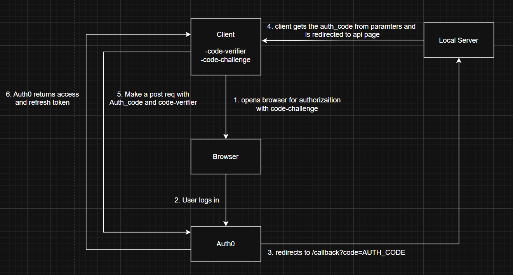

# nocaps

Say no to manual run-time error debugging. Let the AI do it for you.

nocaps is an AI-powered tool that automatically detects, diagnoses, and suggests fixes for run-time errors in your code. Spend less time debugging and more time building. It also roasts your code so you get some first-hand experience of working under a Senior developer.

## Table of Contents

- [Installation](#installation)
- [Usage](#usage)
- [Features](#features)
- [Contributing](#contributing)
- [How It Works](#how-it-works)

## Installation

```bash
git clone https://github.com/yourusername/nocaps.git
cd nocaps
# Add installation steps here
```

## Usage

It is compatible with python, javascript, and java.

```bash
nocaps <your-code-file>
```

## Features

- Suggests fixes for run-time errors
- Roasts your code
- Supports multiple programming languages

## Contributing

Contributions are welcome! Please open issues or submit pull requests.

## How It Works

nocaps uses Gemini 2.0 flash to analyze your code and identify potential run-time errors. It then provides suggestions for fixing these errors, along with explanations to help you understand the underlying issues.

It uses a Auth0 authentication system to ensure secure access and protect user data.

Here's a diagram illustrating the Authorization/Authentication flow:


for more information refer to the [Auth0 documentation](https://auth0.com/docs).

After successful authentication, nocaps directs user's code to the backend server for analysis and debugging.